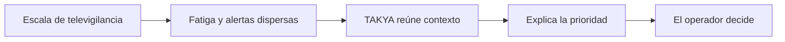

<p align="center">
  
</p>

# TAKYA · Comprender antes de actuar

**Demo funcional con evidencia grabada · octubre de 2026.** Seis clips ligeros permiten observar incidentes, recorrer señales, comprender contexto y registrar una decisión. Casos ofrece Lista o Carrusel con Motion. K8, el perro robot 3D, abre un chat breve centrado sin cambiar de pantalla; puedes ocultarlo desde la cabecera. El chat responde mediante Groq y guías curadas, con validación de entradas y filtro de ámbito en servidor. Home incorpora una cortina al elegir proyecto o consola. Se conserva la identidad visual V1.

Vitrina digital de TAKYA, una propuesta de apoyo a operadores de televigilancia mediante contexto y prioridades explicables. Proyecto desarrollado para el Programa Nómada UCN en Antofagasta.

> **Versión de demostración:** `/landing` presenta el proyecto; `/home` ofrece acceso audiovisual y `/login` permite elegir Operador o Supervisión. `/demo` reproduce registros grabados con señales curadas. El ejercicio y su historial son locales; el chat usa una ruta de servidor hacia Groq. No hay cámaras conectadas, análisis automático del video ni despacho real.

## Navegación rápida

[Ver la landing](#ver-la-v1) · [Probar la consola](#probar-la-consola) · [Iniciar en local](#iniciar-en-local) · [Entender el proyecto](#qué-muestra-la-landing) · [Mapa técnico](#mapa-técnico) · [Antes de compartir](#antes-de-compartir) · [Documentación](#documentación-del-equipo)

## Ver la V1

- **Entrada pública:** `/` redirige a `/landing`.
- **Contenido:** problema de la fatiga cognitiva, propuesta de TAKYA y criterio humano en la decisión.
- **Repositorio:** [Delnr91/takya](https://github.com/Delnr91/takya).

| Ruta       | Estado en esta entrega | Para qué sirve                                |
| ---------- | ---------------------- | --------------------------------------------- |
| `/`        | Pública                | Abre la landing.                              |
| `/landing` | Pública · V1           | Presentación institucional.                   |
| `/home`    | Disponible             | Entrada audiovisual con enlace a `/login`.    |
| `/login`   | Demo                   | Selección simulada de Operador o Supervisión. |
| `/demo`    | Demo                   | Consola interactiva de práctica.              |

## Qué muestra la landing



El relato usa las cifras de contexto de la documentación interna: **130 cámaras** en el sistema municipal de Antofagasta, **1.245 cámaras** como proyección regional y **50 %** como referencia citada sobre eventos no detectados por fatiga visual. La proyección no describe una red operativa actual y ninguna cifra representa un resultado medido por TAKYA.

<details>
<summary><strong>Recorrido sugerido para presentar la V1</strong></summary>

1. Abre `/landing` y explica la idea: **comprender antes de actuar**.
2. Baja a **El problema** para hablar de escala y carga de atención.
3. Muestra **La propuesta**: detectar, agrupar, explicar, verificar y registrar.
4. Cierra con **Nuestro criterio**: la tecnología orienta y la persona decide.

</details>

## Probar la consola

Desde `/landing`, pulsa **Ver demo** en móvil o **Explorar demo** en escritorio. Desde `/home`, pulsa **Consola Interactiva**. Ambos caminos llevan a `/login`: elige un rol de práctica y entra con el botón o la tecla Enter. Si intentas abrir `/demo` sin iniciar la práctica, volverás a la pantalla de acceso. Este paso es solo navegación simulada, no autenticación real.

<details>
<summary><strong>Recorrido de cinco minutos</strong></summary>

1. En **Inicio**, compara los avisos recibidos con los casos agrupados.
2. En **Casos**, elige Lista o Carrusel. Abre un caso, reproduce cada **clip disponible**, usa sus momentos importantes y pulsa **Ya revisé este clip**. El número de clips varía por caso.
3. En **Comprender**, distingue las señales visibles de lo que aún requiere confirmación.
4. En **Decidir**, verifica, escala o descarta e indica el motivo. Si escalas, cambia a **Supervisión** y marca la derivación recibida.
5. Pulsa el perrito 3D para una consulta rápida en la pantalla actual, o abre **K8 IA**. K8 responde con Groq desde guías curadas y puede leer la respuesta en voz alta. Las fuentes quedan opcionales, sin entregar archivos técnicos como respuesta.
6. En **Historial**, revisa la secuencia de acciones y descarga el registro si quieres conservarlo. En **Ajustes**, cambia lectura y ritmo, edita el nombre o cierra la práctica.

La llegada automática comienza pausada. Puedes generar un caso manualmente, elegir el ritmo, cambiar el tamaño del texto o reiniciar la práctica. El progreso reconoce las tres revisiones iniciales sin puntuar rapidez ni favorecer una decisión.

</details>

Los nuevos ejercicios usan registros grabados de fuego, residuos y un camión sin descarga visible. La llegada de avisos y la recepción por Supervisión son simuladas; ninguna decisión despacha recursos. Las señales y sugerencias están curadas: K8 no recibe videos ni ve el caso abierto. Las sesiones ilustradas anteriores se conservan hasta reiniciar con confirmación. **Ocultar ayuda lateral** amplía el visor; **Ocultar K8** retira la mascota. Movimiento reducido, texto grande, alto contraste y paneles sólidos ayudan a adaptar la lectura. Consulta el [recorrido funcional](docs/06_DEMO_OPERATOR_FLOW.md), el [registro de edición de videos](docs/media/README.md) y la [decisión de arquitectura](docs/adr/0005-recorded-evidence-and-cognitive-motion.md).

<details>
<summary><strong>Configurar el chat sin exponer claves</strong></summary>

Configura `GROQ_API_KEY` en `.env.local` y en las variables privadas del servidor de Vercel. Nunca uses el prefijo `NEXT_PUBLIC_` ni subas una clave a Git. `.env*` está excluido del repositorio. Sin la variable, el chat explica que no puede responder y conserva la pregunta.

La ruta valida origen, formato, longitud y orden de mensajes, limita solicitudes y redirige temas ajenos antes del proveedor. Los intentos rechazados y patrones de claves no se reenvían en el historial. Estos filtros reducen abuso conocido; no sustituyen autenticación ni límites distribuidos para una plataforma operativa.

</details>

Para la siguiente etapa, consulta las [opciones de arquitectura IA-first](docs/07_ARQUITECTURA_IA_FIRST.md) y la [revisión de seguridad](docs/08_REVISION_SEGURIDAD.md). El camino recomendado es un sistema híbrido: detectar eventos cerca de la fuente, reunirlos en casos y producir explicaciones verificables desde un servicio protegido.

## Iniciar en local

Requisitos: Node.js y npm. Desde la raíz del repositorio:

```bash
npm ci
npm run dev
```

Abre [http://localhost:3000](http://localhost:3000). La redirección te llevará a `/landing`.

<details>
<summary><strong>Comandos de verificación</strong></summary>

```bash
npm run typecheck
npm run lint
npm run test:demo
npm run format:check
npm run build
```

`npm run build` genera la misma compilación de producción que utiliza Vercel. Si alguna comprobación falla, revisa el resultado antes de publicar nuevos cambios.

En esta entrega pasaron TypeScript, ESLint, 24 pruebas del dominio/chat y la compilación de producción. Se comprobó en navegador el recorrido desde los clips hasta la recepción de Supervisión, el chat con Groq, el carrusel, las cortinas y las vistas de 320, 390 y 768 px. La revisión completa y los límites están en [ENGRAM.md](ENGRAM.md). El comando global `format:check` conserva observaciones de formato heredado; los archivos de esta entrega se formatearon.

</details>

## Mapa técnico

| Lugar                                            | Contenido                                                        |
| ------------------------------------------------ | ---------------------------------------------------------------- |
| [`src/app/`](src/app/)                           | Rutas, layout, fuentes y estilos globales de Next.js App Router. |
| [`src/features/landing/`](src/features/landing/) | Componentes y movimiento de la página pública.                   |
| [`src/features/home/`](src/features/home/)       | Entrada audiovisual existente.                                   |
| [`src/features/demo/`](src/features/demo/)       | Motor local, práctica guiada, roles e historial de la consola.   |
| [`public/brand/`](public/brand/)                 | Logotipos, iconos y poster de marca.                             |
| [`public/referencias/`](public/referencias/)     | Referencias visuales del equipo.                                 |
| [`docs/`](docs/)                                 | Producto, arquitectura, diseño y plan maestro.                   |

**Stack:** Next.js App Router, React, TypeScript estricto, Tailwind CSS y Framer Motion. La landing no requiere variables de entorno ni servicios externos para funcionar.

<details>
<summary><strong>Despliegue manual en Vercel</strong></summary>

1. En Vercel, crea un proyecto e importa [Delnr91/takya](https://github.com/Delnr91/takya).
2. Selecciona la rama `main` y deja la **raíz del proyecto** en `/`.
3. Comprueba que Vercel detecte **Next.js** y use `npm run build`.
4. Esta landing no necesita variables de entorno.
5. Despliega y revisa `/`, `/landing`, `/home`, `/login` y `/demo` en escritorio y móvil. La raíz debe abrir la landing; el acceso a la consola empieza en `/login`.

Si intentaste desplegar antes de recibir el nuevo commit en `main`, vuelve a ejecutar el despliegue desde ese commit y mira el final de **Build Logs** si Vercel informa otro error.

Si conectas GitHub al proyecto de Vercel, los cambios posteriores en `main` podrán generar nuevos despliegues automáticamente.

</details>

## Antes de compartir

- Presenta la consola como **demostración funcional con evidencia grabada**. El flujo se puede completar; las llegadas y la coordinación son simuladas y no hay conexión a CCTV.
- Las cifras de contexto provienen de documentos del proyecto; evita describirlas como resultados de TAKYA.
- El botón de WhatsApp de la versión actual usa un **número de ejemplo**. El equipo debe reemplazarlo por un canal real antes de utilizarlo como contacto comercial.
- La landing conserva la presentación V1. La consola es una práctica visual y sus roles no representan cuentas o permisos reales.

## Documentación del equipo

- [PRD: alcance y rutas](docs/01_PRD_TAKYA.md)
- [Arquitectura y reglas técnicas](docs/02_ARCHITECTURE_TRD.md)
- [Sistema de diseño](docs/03_DESIGN_SYSTEM.md)
- [Identidad visual](docs/05_IDENTIDAD_VISUAL_PPT_A.md)
- [Plan maestro](docs/maestros/PLAN_MAESTRO_CONSTRUCCION_TAKYA.md)
- [Recorrido de la consola](docs/06_DEMO_OPERATOR_FLOW.md)
- [Arquitectura IA-first](docs/07_ARQUITECTURA_IA_FIRST.md)
- [Revisión de seguridad](docs/08_REVISION_SEGURIDAD.md)
- [ENGRAM: estado de construcción](ENGRAM.md)

---

**Criterio de trabajo:** cambios pequeños, TypeScript sin `any`, componentes por feature y decisiones documentadas en `ENGRAM.md`.
