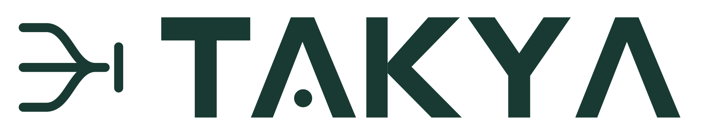
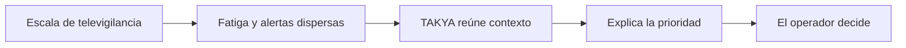

<p align="center">
  
</p>

# TAKYA · Comprender antes de actuar

Vitrina digital de TAKYA, una propuesta de apoyo a operadores de televigilancia mediante contexto y prioridades explicables. Proyecto desarrollado para el Programa Nómada UCN en Antofagasta.

> **V1 para mostrar:** la experiencia pública comienza en `/landing`. La consola interactiva y el acceso simulado quedan para una siguiente entrega. No hay backend ni conexión a cámaras reales.

## Navegación rápida

[Ver la landing](#ver-la-v1) · [Iniciar en local](#iniciar-en-local) · [Entender el proyecto](#qué-muestra-la-landing) · [Mapa técnico](#mapa-técnico) · [Antes de compartir](#antes-de-compartir) · [Documentación](#documentación-del-equipo)

## Ver la V1

- **Entrada pública:** `/` redirige a `/landing`.
- **Contenido:** problema de la fatiga cognitiva, propuesta de TAKYA y criterio humano en la decisión.
- **Repositorio:** [Delnr91/takya](https://github.com/Delnr91/takya).

| Ruta               | Estado en esta entrega | Para qué sirve                                                                |
| ------------------ | ---------------------- | ----------------------------------------------------------------------------- |
| `/`                | Pública                | Abre la landing.                                                              |
| `/landing`         | Pública · V1           | Presentación institucional.                                                   |
| `/home`            | Disponible             | Entrada audiovisual adaptable; fuera del recorrido público de esta V1.        |
| `/login` y `/demo` | Siguiente entrega      | Acceso y consola simulados; no forman parte de la presentación de la landing. |

## Qué muestra la landing



El relato usa las cifras de contexto de la documentación interna: **130 cámaras** en el sistema municipal de Antofagasta, **1.245 cámaras** como proyección regional y **50 %** como referencia citada sobre eventos no detectados por fatiga visual. La proyección no describe una red operativa actual y ninguna cifra representa un resultado medido por TAKYA.

<details>
<summary><strong>Recorrido sugerido para presentar la V1</strong></summary>

1. Abre `/landing` y explica la idea: **comprender antes de actuar**.
2. Baja a **El problema** para hablar de escala y carga de atención.
3. Muestra **La propuesta**: detectar, agrupar, explicar, verificar y registrar.
4. Cierra con **Nuestro criterio**: la tecnología orienta y la persona decide.

</details>

## Iniciar en local

Requisitos: Node.js y npm. Desde la raíz del repositorio:

```bash
npm ci
npm run dev
```

Abre [http://localhost:3000](http://localhost:3000). La redirección te llevará a `/landing`.

<details>
<summary><strong>Comandos de verificación</strong></summary>

```bash
npm run typecheck
npm run lint
npm run format:check
npm run build
```

`npm run build` genera la misma compilación de producción que utiliza Vercel. Si alguna comprobación falla, revisa el resultado antes de publicar nuevos cambios.

En esta entrega, TypeScript, lint y build pasan. `format:check` aún detecta formato heredado en archivos anteriores; el detalle está en [ENGRAM.md](ENGRAM.md).

</details>

## Mapa técnico

| Lugar                                            | Contenido                                                        |
| ------------------------------------------------ | ---------------------------------------------------------------- |
| [`src/app/`](src/app/)                           | Rutas, layout, fuentes y estilos globales de Next.js App Router. |
| [`src/features/landing/`](src/features/landing/) | Componentes y movimiento de la página pública.                   |
| [`src/features/home/`](src/features/home/)       | Entrada audiovisual existente.                                   |
| [`src/features/demo/`](src/features/demo/)       | Trabajo de consola para la siguiente entrega.                    |
| [`public/brand/`](public/brand/)                 | Logotipos, iconos y poster de marca.                             |
| [`public/referencias/`](public/referencias/)     | Referencias visuales del equipo.                                 |
| [`docs/`](docs/)                                 | Producto, arquitectura, diseño y plan maestro.                   |

**Stack:** Next.js App Router, React, TypeScript estricto, Tailwind CSS y Framer Motion. La landing no requiere variables de entorno ni servicios externos para funcionar.

<details>
<summary><strong>Despliegue manual en Vercel</strong></summary>

1. En Vercel, crea un proyecto e importa [Delnr91/takya](https://github.com/Delnr91/takya).
2. Selecciona la rama `main` y deja la **raíz del proyecto** en `/`.
3. Comprueba que Vercel detecte **Next.js** y use `npm run build`.
4. Esta landing no necesita variables de entorno.
5. Despliega y revisa `/` y `/landing` en escritorio y móvil. La raíz debe abrir la landing.

Si intentaste desplegar antes de recibir el nuevo commit en `main`, vuelve a ejecutar el despliegue desde ese commit y mira el final de **Build Logs** si Vercel informa otro error.

Si conectas GitHub al proyecto de Vercel, los cambios posteriores en `main` podrán generar nuevos despliegues automáticamente.

</details>

## Antes de compartir

- Presenta la web como **prototipo de propuesta**, no como sistema conectado a CCTV.
- Las cifras de contexto provienen de documentos del proyecto; evita describirlas como resultados de TAKYA.
- El botón de WhatsApp de la versión actual usa un **número de ejemplo**. El equipo debe reemplazarlo por un canal real antes de utilizarlo como contacto comercial.
- `/login` y `/demo` permanecen en el repositorio para el siguiente sprint; esta V1 se comparte mediante `/landing`.

## Documentación del equipo

- [PRD: alcance y rutas](docs/01_PRD_TAKYA.md)
- [Arquitectura y reglas técnicas](docs/02_ARCHITECTURE_TRD.md)
- [Sistema de diseño](docs/03_DESIGN_SYSTEM.md)
- [Identidad visual](docs/05_IDENTIDAD_VISUAL_PPT_A.md)
- [Plan maestro](docs/maestros/PLAN_MAESTRO_CONSTRUCCION_TAKYA.md)
- [ENGRAM: estado de construcción](ENGRAM.md)

---

**Criterio de trabajo:** cambios pequeños, TypeScript sin `any`, componentes por feature y decisiones documentadas en `ENGRAM.md`.
