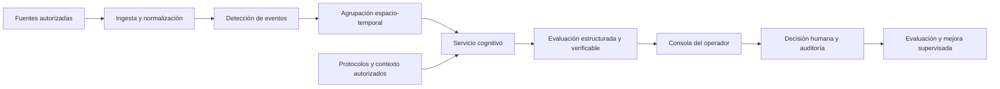

# TAKYA como plataforma cognitiva IA-first

## Situación actual

La consola implementa un **copiloto de demostración**. `src/features/demo/model/cognitive.ts` convierte escenarios locales en una evaluación validada por Zod: prioridad sugerida, explicación, hechos visibles, incertidumbre, referencias a avisos, puntuación de ejemplo y versión. No hay inferencia real. El operador conserva la decisión y el historial registra sus motivos.

K8 añade una consulta documental local: `model/knowledge.ts` recupera respuestas curadas desde `data/knowledge.ts`, muestra la referencia y se abstiene cuando no hay un tema cubierto. Es una maqueta del flujo de recuperación, no un RAG operativo ni un modelo generativo. Sus límites, accesibilidad y evolución se detallan en `docs/09_K8_CONOCIMIENTO_Y_ACCESIBILIDAD.md`.

## Qué significa IA-first en TAKYA

La unidad principal de trabajo es el **caso con contexto y evidencia**, no una cuadrícula de cámaras ni un chat genérico. La IA ayuda a reunir avisos, ordenar la atención y explicar por qué; el operador compara fuentes, corrige y decide. Si falta evidencia o la evaluación es incierta, el sistema debe poder abstenerse y pedir revisión.

El **servicio cognitivo** debe vivir en un backend protegido o en infraestructura municipal autorizada, según el acuerdo de datos. Nunca se debe llamar a un proveedor con una clave desde el navegador. La consola solo recibe el resultado permitido para su rol. El servicio debe asociar cada afirmación con avisos o fotogramas autorizados, etiquetar lo desconocido y devolver un objeto conforme al contrato de `schemas/cognitive.ts`. `validateAssessment` rechaza referencias a avisos ajenos al caso.

## Alternativas

| Opción | Qué hace | Ventaja | Límite | Uso recomendado |
| --- | --- | --- | --- | --- |
| **A. Reglas y metadatos** | Detectores existentes entregan avisos; reglas de lugar, tiempo y prioridad los agrupan. | Explicación sencilla, bajo costo, buen primer piloto. | Reconoce poco contexto nuevo y requiere mantener reglas. | Piloto inicial con datos limitados. |
| **B. Sistema híbrido** | Detección cerca de la fuente; agrupación temporal; modelo de lenguaje/visión en un servicio protegido que explica evidencia y protocolos. | Mejor equilibrio entre contexto, costo y trazabilidad. | Requiere ingeniería de datos, evaluación y controles de privacidad. | **Ruta objetivo de TAKYA.** |
| **C. Modelo multimodal sobre clips** | Analiza muestras de video autorizadas para generar hipótesis de situación. | Puede interpretar eventos nuevos y relaciones visuales. | Mayor latencia, costo, exposición de datos y riesgo de errores plausibles. | Investigación acotada, nunca como decisión autónoma. |

## Ruta de implementación

1. **Instrumentar el piloto:** definir taxonomía de eventos, origen, tiempos, identificador de cámara, permisos y calidad de datos. Reunir casos reales autorizados con criterios de etiquetado; separar evidencia de hipótesis.
2. **Conectar metadatos:** sustituir el generador local por una ingesta segura de eventos, sin enviar video completo cuando basten metadatos. Persistir casos, permisos y eventos de auditoría en servidor.
3. **Introducir recomendación híbrida:** desplegar correlación y evaluación cognitiva detrás de una API. Validar esquema, referencias, versión del modelo y umbrales. Mostrar explicación y posibilidad de «no hay evidencia suficiente».
4. **Aprender con supervisión:** registrar correcciones del operador y resultados verificados; evaluar antes de actualizar modelos o prioridades. Ninguna corrección individual debe cambiar el modelo en producción de forma automática.

## Criterios de aceptación antes de operar

- Medir eventos críticos omitidos, falsos avisos, tiempo de revisión, calibración de la puntuación y desacuerdos del operador. Comparar contra el proceso actual; las cifras del demo no sirven como línea base.
- Probar explicaciones con operadores: deben poder localizar las fuentes citadas, detectar información ausente y justificar su decisión.
- Mantener decisiones y escalamiento bajo control humano. Un modelo no debe despachar recursos, cerrar casos ni modificar el historial por sí solo.
- Aplicar acceso por municipio y rol, retención acordada, controles de datos personales, trazabilidad del modelo y pruebas de seguridad antes de conectar cámaras reales.
