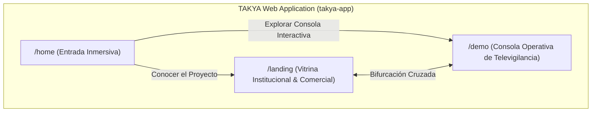
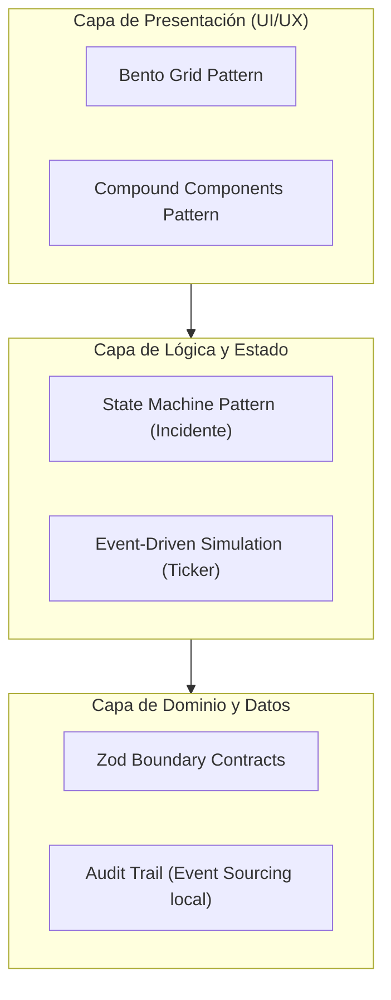
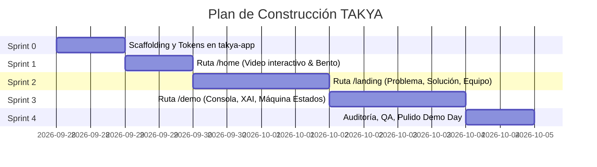

# TAKYA · Plan Maestro de Construcción y Arquitectura de Software

> **Documento Rector de Ingeniería, Patrones de Diseño y Hoja de Ruta**  
> **Ubicación:** `C:\Users\invde\Desktop\TAKYA\PLAN_MAESTRO_CONSTRUCCION_TAKYA.md`  
> **Fecha:** 28 de septiembre de 2026  
> **Versión:** 1.0.0 (Aprobado para ejecución)  
> **Autor / CTO:** Dev AI & Equipo Fundador TAKYA  
> **Marco:** Programa Nómada 2026 — USQAI / Universidad Católica del Norte (UCN)  
> **Estándar:** Protocolo del Agente Constructor (Lattice & TAKYA) · "Structural Silence"  

---

## 1. Visión Estratégica y Definición de Producto

TAKYA nace de una validación real con operadores de televigilancia en Antofagasta (donde el sistema municipal pasó de 30 a 130 cámaras 24/7 y la región proyecta 1.245 cámaras y 64 pórticos lectores de patentes). 

* **El Problema:** La saturación cognitiva del operador humano. Monitorear cientos de pantallas en simultáneo provoca la pérdida de hasta el 50% de eventos críticos y cientos de falsas alarmas repetidas.
* **La Solución:** Asistente de contexto con **Inteligencia Artificial Explicable (XAI)** y **Control Humano Estricto (Human-in-the-Loop)**. TAKYA agrupa alertas concurrentes, sugiere prioridades explicables y permite al operador verificar, escalar o descartar con trazabilidad total.
* **El Propósito de este Software:** Entregar una experiencia digital integral de grado profesional para el **Demo Day Nómada UCN**, inversionistas y validación con municipalidades, conformada por **3 rutas independientes y especializadas**:



---

## 2. Especificación Detallada de las 3 Rutas

### Ruta 1: `/home` (o `/`) — Entrada Inmersiva y Bifurcación
* **Objetivo:** Generar impacto visual inmediato de nivel industrial ("Structural Silence"), transmitiendo seriedad, tecnología y seguridad institucional.
* **Componentes Principales:**
  1. **Background Audiovisual Interactivo:**
     * Video o canvas ambiental optimizado en bucle (textura espacial, red de nodos o estética nocturna de vigilancia sobria).
     * Fallback progresivo automático a poster estático de alta resolución (`referencias/TAKYA_BACKGROUND_HOME_A_COLOR_v01.png`) si hay red lenta o `prefers-reduced-motion`.
     * Controles discretos de pausa/reproducción accesibles.
  2. **Overlay de Alto Contraste:** Gradiente oscuro calibrado (`#0C1410` / `#0A0A0A` con transparencias) para garantizar legibilidad WCAG AAA.
  3. **Identidad de Marca:** Logotipo oficial SVG en Marfil Cálido (`#F4F1EA`) y Slogan *"Comprender antes de actuar"*.
  4. **Bifurcador de Acciones (Dual CTA Bento):**
     * **Tarjeta 1 — Conocer la Iniciativa (`/landing`):** Enfocada en la tesis de negocio, el problema municipal, el respaldo de Nómada UCN y el contacto comercial.
     * **Tarjeta 2 — Probar la Consola Simulada (`/demo`):** Acceso directo a la simulación interactiva del centro de monitoreo.

### Ruta 2: `/landing` — Vitrina Pública, Institucional y Comercial
* **Objetivo:** Comunicar con rigor y transparencia la propuesta de valor a compradores municipales, evaluadores de USQAI Nómada y aliados estratégicos.
* **Estructura en Bento Grid Modular:**
  1. **Header / Navbar:** Logo TAKYA, enlaces de navegación suave, tag *"Programa Nómada UCN 2026"* y botón destacado *"Ingresar a Demo"*.
  2. **Hero Section:** Titular contundente: *"Claridad operativa para decidir con contexto"*. Subtítulo sin afirmaciones falsas ni promesas mágicas.
  3. **Bento de Evidencia & Problema Territorial:**
     * Métrica 1: De 30 a 130 cámaras activas en Antofagasta (proyección regional 1.245 cámaras).
     * Métrica 2: 50% de conductas no detectadas por fatiga visual en estudios de campo.
     * Métrica 3: Cientos de alertas falsas repetidas por cámara fija.
  4. **El Flujo TAKYA en 5 Pasos:**
     * *Paso 1: Detección Multiseñal* (Cámaras, sensores, lectores).
     * *Paso 2: Agrupación Contextual* (Unifica alertas dispersas de un mismo incidente).
     * *Paso 3: Priorización Explicable* (Nivel de riesgo justificado en texto claro).
     * *Paso 4: Decisión del Operador* (El humano siempre valida o descarta).
     * *Paso 5: Registro de Auditoría* (Trazabilidad inmutable de la respuesta).
  5. **Diferenciador Ético y Normativo:** Cumplimiento de la Ley 19.628 de Protección de Datos de Chile, enfoque human-in-the-loop y principios de IA explicable (XAI).
  6. **Equipo y Validación Interdisciplinaria:**
     * Dev AI / CTO (Arquitectura e IA).
     * 2 Estudiantes de Ingeniería Civil UCN (Operaciones e Infraestructura).
     * 1 Estudiante de Ingeniería Comercial UCN (Modelo de Negocio & Finanzas).
     * Respaldo USQAI / Universidad Católica del Norte.
  7. **Footer & Conversión:** Formulario de solicitud de contacto y diálogo institucional con validación Zod.

### Ruta 3: `/demo` — Consola de Operador de Televigilancia (Simulación Interactiva)
* **Objetivo:** Demostrar en vivo cómo el software resuelve la sobrecarga de información mediante un flujo interactivo realista, visual y completamente funcional.
* **Arquitectura de la Consola:**
  1. **Top Bar Operativa:**
     * Indicadores RED en tiempo real:
       * *Alertas Brutas Recibidas:* 184
       * *Incidentes Sintetizados:* 23 (Reducción del 87.5% de ruido)
       * *Incidentes Críticos Activos:* 3
       * *Tiempo Promedio de Decisión:* 42s
     * Botón de reinicio de simulación y control de ritmo (Pausar / Continuar eventos).
  2. **Panel Izquierdo — Feed de Incidentes Priorizados:**
     * Lista filtrable por Severidad (*Alta*, *Media*, *Informativa*) y Estado (*Pendiente*, *En Revisión*, *Resuelto*).
     * Cada tarjeta muestra: ID de incidente, cámaras asociadas (ej. "CAM-04 + CAM-07"), ubicación (ej. "Paseo Prat / Matta"), badge de criticidad y tiempo transcurrido.
  3. **Panel Central — Visor de Evidencia y Contexto:**
     * Reproductor de video simulado (cámara CCTV con overlay de telemetría: fecha, hora, FPS, coordenadas, bounding box animado).
     * Selector de cámaras del mismo evento (ej. "Ver perspectiva CAM-07").
     * Línea de tiempo de eventos detectados.
  4. **Panel Derecho / Modal — Núcleo XAI (Explicabilidad de IA):**
     * Desglose pedagógico: *"¿Por qué TAKYA priorizó este evento?"*
       * Señal 1: Concurrencia de 3 alertas en menos de 90 segundos.
       * Señal 2: Cruce de trayectoria entre dos cámaras contiguas.
       * Señal 3: Coincidencia con zona de alto flujo peatonal.
     * Nivel de confianza: 89% (con advertencia de verificación obligatoria).
  5. **Barra de Acción Humana (Innegociable):**
     * **[Verificar Incidente]** $\rightarrow$ Marca el evento como confirmado por el operador.
     * **[Escalar a Seguridad / Patrulla]** $\rightarrow$ Despliega modal de despacho con protocolo municipal.
     * **[Descartar como Falsa Alarma]** $\rightarrow$ Permite al operador ingresar motivo y retroalimentar el sistema.
  6. **Registro de Auditoría (Audit Trail) en Vivo:**
     * Drawer inferior o lateral con el log inmutable de todas las acciones tomadas por el operador (timestamp ISO, operador ID, acción, motivo).

---

## 3. Arquitectura Técnica y Patrones de Diseño

El proyecto se estructurará siguiendo los estándares de **"Structural Silence"** y el **Protocolo del Agente Constructor**.

### Stack Tecnológico Principal
* **Framework:** Next.js 14+ (App Router, Server Components para contenido estático, Client Components para reactividad en la consola).
* **Lenguaje:** TypeScript en modo estricto (`strict: true`, `noUncheckedIndexedAccess: true`, cero `any`).
* **Estilizado & UI:** Tailwind CSS con tokens de diseño centralizados, Shadcn/UI (Radix primitives) y Lucide Icons.
* **Animaciones & Transiciones:** Framer Motion (micro-interacciones funcionales <250ms, respetando `prefers-reduced-motion`).
* **Validación de Datos:** Zod para contratos de datos de alertas, incidentes y formularios de contacto.
* **Gestión de Estado:** 
  * URL State (`useSearchParams`) para filtros de la consola `/demo`.
  * Local State y React Context / Reducer para la máquina de estados de los incidentes.
  * LocalStorage para persistencia del Audit Trail durante la sesión.

### Patrones de Diseño de Software



1. **Feature-Sliced Architecture (Colocación por Dominio):**  
   El código no se divide por "tipo de archivo" (no todo mezclado en `components/`), sino por **dominios funcionales**:
   * `src/features/home/`
   * `src/features/landing/`
   * `src/features/demo-console/`
   * `src/features/audit/`
   * `src/features/shared/`

2. **State Machine Pattern para el Ciclo de Vida del Incidente:**
   Los incidentes en `/demo` transicionan siguiendo un autómata finito determinista:
   $$\text{PENDING} \longrightarrow \text{IN\_REVIEW} \longrightarrow \begin{cases} \text{VERIFIED} \rightarrow \text{ESCALATED} \\ \text{DISMISSED (False Alarm)} \end{cases}$$
   Imposibilita estados inconsistentes (un incidente no puede escalarse sin ser revisado).

3. **Event-Driven Simulation Engine (Simulador en Vivo):**
   Un servicio liviano (`SimulationTicker`) que emite eventos simulados a intervalos configurables, permitiendo al jurado ver la consola actualizándose como si estuviera conectada a una sala de cámaras real.

4. **Compound Components Pattern:**
   Para componentes complejos de la consola:
   `<IncidentCard> <IncidentCard.VideoPreview /> <IncidentCard.Signals /> <IncidentCard.Actions /> </IncidentCard>`

5. **Audit Trail Pattern (Inmutabilidad):**
   Cada clic del operador genera un objeto `AuditLogEntry` inmutable con hash o ID único, timestamp de alta precisión y contexto de la decisión.

---

## 4. Estructura Exacta de Archivos en `takya-app`

La raíz del código estará exclusivamente en `C:\Users\invde\Desktop\TAKYA\takya-app`:

```text
takya-app/
├── package.json
├── tsconfig.json                      # strict: true, noUncheckedIndexedAccess: true
├── tailwind.config.ts                 # Tokens: bosque, marfil, salvia, dark
├── next.config.mjs
├── public/
│   ├── brand/
│   │   ├── takya-simbolo-bosque.svg   # Importados desde ../imagenes A/
│   │   ├── takya-simbolo-marfil.svg
│   │   ├── takya-principal-bosque.svg
│   │   └── favicon.ico
│   ├── media/
│   │   ├── home-bg-poster.webp
│   │   └── demo-cctv-sample.mp4       # Video loop simulado
│   └── mock/
│       └── simulated_incidents.json
├── src/
│   ├── app/
│   │   ├── layout.tsx                 # Root layout con fuentes Sora/Jakarta y metadata SEO
│   │   ├── page.tsx                   # Redirección o Home principal
│   │   ├── home/
│   │   │   └── page.tsx               # Ruta /home con background interactivo
│   │   ├── landing/
│   │   │   └── page.tsx               # Ruta /landing (Bento, problema, solución, equipo)
│   │   └── demo/
│   │       └── page.tsx               # Ruta /demo (Consola de televigilancia interactiva)
│   ├── components/ui/                 # Primitivas Radix / Shadcn (button, modal, badge, drawer)
│   ├── features/
│   │   ├── home/
│   │   │   ├── components/            # InteractiveVideoBg, DualBentoSelector, BrandHeader
│   │   │   └── hooks/
│   │   ├── landing/
│   │   │   ├── components/            # HeroSection, ProblemBento, FiveStepsFlow, TeamSection, CTAForm
│   │   │   └── schemas/contact.ts     # Zod schema de contacto
│   │   ├── demo/
│   │   │   ├── components/            # ConsoleHeader, IncidentList, VideoPlayer, XaiModal, ActionControls, AuditLogDrawer
│   │   │   ├── hooks/useSimulation.ts # Motor del simulador de eventos
│   │   │   ├── hooks/useIncidentState.ts # Máquina de estados
│   │   │   ├── schemas/incident.ts    # Zod schemas para Incident, Alert, Action
│   │   │   └── data/initialMock.ts    # Datos calibrados basados en Antofagasta
│   │   └── shared/
│   │       ├── components/Navbar.tsx
│   │       └── components/Footer.tsx
│   ├── lib/
│   │   ├── utils.ts                   # cn helper (clsx + tailwind-merge)
│   │   └── audit-logger.ts            # Gestor inmutable de auditoría local
│   └── styles/
│       └── globals.css                # Custom utilities, base glassmorphism
└── docs/
    └── adr/                           # Architecture Decision Records
```

---

## 5. Tokens de Diseño y Guía de Estilo ("Structural Silence")

* **Paleta Cromática Oficial:**
  * `--color-forest`: `#1B3B2B` (Verde bosque profundo, institucional y protector).
  * `--color-ivory`: `#F4F1EA` (Marfil cálido, contraste humano para texto y fondos claros).
  * `--color-sage`: `#7D9B8A` (Salvia, color de acento y estados controlados).
  * `--color-dark-surface`: `#0C1410` (Superficie oscura para el centro de control).
  * `--color-dark-bg`: `#060A08` (Negro bosque de fondo para video y consola).
  * `--color-alert-critical`: `#E05D44` (Rojo teja controlado, nunca fosforescente).
  * `--color-alert-medium`: `#D99B26` (Ámbar sobrio).
  * `--color-alert-info`: `#4A7C59` (Verde atenuado de confirmación).
* **Tipografías:**
  * Display / Titulares: `Sora`, sans-serif (geométrica y moderna).
  * Lectura / UI / Consola: `Plus Jakarta Sans`, sans-serif (alta legibilidad en tamaños reducidos).
  * Telemetría / Metadatos: `JetBrains Mono`, monospace (coordenadas, tiempos, IDs de cámara).

---

## 6. Plan de Ejecución por Sprints (Roadmap Paso a Paso)



### Sprint 0: Inicialización y Scaffolding (Inmediato)
1. Inicializar proyecto Next.js 14+ con TypeScript estricto en `Desktop/TAKYA/takya-app`.
2. Configurar Tailwind con los tokens oficiales de color y fuentes.
3. Copiar e integrar los assets oficiales SVG y favicons desde `Desktop/TAKYA/imagenes A/`.
4. Registrar el primer ADR: `docs/adr/0001-stack-nextjs-app-router.md`.

### Sprint 1: Construcción de la Ruta `/home`
1. Crear layout inmersivo con componente `InteractiveVideoBg` con fallback a imagen poster fija.
2. Implementar selector bifurcado (Dual Bento Card) hacia `/landing` y `/demo`.
3. Validar accesibilidad (`prefers-reduced-motion`, navegación por teclado, focus rings).

### Sprint 2: Construcción de la Ruta `/landing`
1. Ensamblar Bento Grid con la narrativa del dolor territorial en Antofagasta (130 $\rightarrow$ 1.245 cámaras).
2. Sección visual del flujo en 5 pasos y principios de IA explicable.
3. Sección de equipo (Civil + Comercial + AI Dev) y sello USQAI Nómada UCN.
4. Formulario de contacto tipado con Zod y feedback accesible.

### Sprint 3: Construcción de la Consola Interactiva `/demo`
1. Implementar panel de KPIs superiores con contadores animados.
2. Desarrollar feed de incidentes con filtros de severidad y búsqueda rápida.
3. Crear visor simulado de cámara con overlay de telemetría y selector multicámara.
4. Desarrollar Modal de Explicabilidad XAI (*"¿Por qué se agrupó?"*).
5. Implementar barra de decisión humana: `[Verificar]`, `[Escalar]`, `[Descartar]` conectada a la máquina de estados.
6. Habilitar panel de Registro de Auditoría (Audit Log) con persistencia en localStorage.

### Sprint 4: Control Pre-Despliegue y Preparación Demo Day
1. Ejecutar lista de chequeo de `03_TAKYA_ANTES_DE_DESPLEGAR.md`.
2. Pruebas de rendimiento Web Vitals (LCP < 2.5s, CLS < 0.1).
3. Prueba de pitch / ensayo de navegación para la presentación ante el jurado de USQAI.

---

## 7. Criterios de Aceptación Innegociables (Definition of Done)

* [ ] Las tres rutas (`/home`, `/landing`, `/demo`) responden sin errores de consola ni enlaces rotos.
* [ ] Cero uso de `any` en todo el código TypeScript.
* [ ] Todos los datos mostrados en la demo están explícitamente rotulados como **"Simulación Interactiva para Validación Conceptual"** (honestidad con evaluadores e inversionistas).
* [ ] La consola interactiva permite al usuario completar un ciclo completo de decisión (Revisar $\rightarrow$ Ver XAI $\rightarrow$ Decidir $\rightarrow$ Ver Auditoría).
* [ ] La paleta y tipografía cumplen con la identidad oficial del Sistema A.
