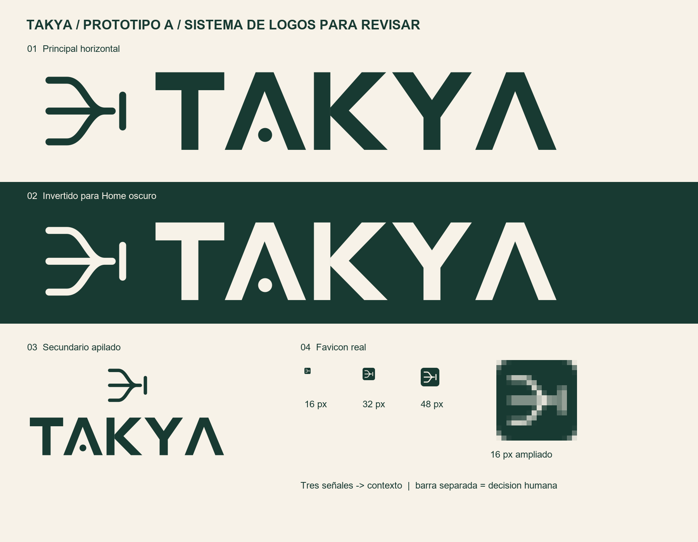

# TAKYA · Sistema de logos del prototipo A

**Estado:** propuesta completa para revisión del equipo; no es una marca aprobada ni acredita disponibilidad legal.  
**Separación:** el ojo/cámara y la pieza de tres brazos de `TAKYA/IMG/` corresponden a la exploración del modelo B (dron y cámaras). **No se usan para A.** Ningún archivo de B se borró ni se transformó para producir estos logos. La primera exploración vectorial de A se archivó en `referencias/archivo-logo-A-2026-09-27/` para que no compita con este sistema nuevo.

## Idea de A

Tres entradas visuales se reúnen en una información comprensible. Una barra separada al final marca el punto donde **una persona revisa y decide**. Es una propuesta visual para la misión del prototipo A; no representa una cámara, un lente, un dron ni vigilancia autónoma. El nombre TAKYA retoma el carácter del lettering señalado por el fundador: «A» abiertas y un punto en la primera «A». Está redibujado como geometría vectorial, sin depender de una fuente instalada. La composición tipográfica de la web se estudia aparte en `04_vistas_revision/ESTUDIO_TIPOGRAFICO_A.png` y `SISTEMA_TIPOGRAFICO_A.png`: Sora para titulares y Plus Jakarta Sans para interfaz y lectura.

## Archivos, uno por función

| Orden | Pieza | SVG maestro | PNG de uso |
| --- | --- | --- | --- |
| 01 | **Principal horizontal, bosque** para marfil/blanco | `01_maestros_svg/takya-a-principal-bosque.svg` | `02_png_transparentes/takya-a-principal-bosque-2048.png` |
| 02 | **Principal invertido, marfil** para bosque oscuro | `01_maestros_svg/takya-a-principal-marfil.svg` | `02_png_transparentes/takya-a-principal-marfil-2048.png` |
| 03 | **Secundario apilado**, oscuro y claro | `01_maestros_svg/takya-a-secundario-bosque.svg`, `…-marfil.svg` | PNG transparentes de 1536 px |
| 04 | **Logotipo sin símbolo**, oscuro y claro | `01_maestros_svg/takya-a-logotipo-bosque.svg`, `…-marfil.svg` | PNG transparentes de 1536 px |
| 05 | **Símbolo aislado**, oscuro y claro | `01_maestros_svg/takya-a-simbolo-bosque.svg`, `…-marfil.svg` | PNG transparentes de 1024 px |
| 06 | **Monocromo** negro y blanco | `01_maestros_svg/takya-a-monocromo-negro.svg`, `…-blanco.svg` | PNG transparentes de 2048 px |
| 07 | **Favicon e iconos** | `03_favicon_iconos/favicon.svg`, `favicon-claro.svg` | `favicon.ico`, PNG 16/32/48/180/192/512, Apple Touch y PWA enmascarable |

Los PNG de logo tienen **transparencia real**. Los favicons llevan una placa sólida de color para conservar legibilidad en pestañas de distintos temas. `03_favicon_iconos/favicon.ico` reúne tamaños de 16, 32 y 48 px. Las versiones para instalación solo se utilizarán si el sitio incorpora esa capacidad; no implican una PWA aprobada. `MANIFIESTO.json` registra los nombres y sumas de verificación.

## Usos y límites

- Sobre marfil o blanco, usar bosque. Sobre bosque oscuro, usar marfil. En fotografías, poner una zona sólida o una capa que sostenga el contraste.
- Usar el logo horizontal cuando haya ancho; el apilado cuando la composición sea vertical. Para tamaños mínimos, usar el símbolo aislado o favicon. No poner el slogan dentro del favicon.
- Mantener la forma y sus espacios; no añadir lente, hélice, ojo, escudo, brillo metálico, degradado ni fondo cuadriculado.
- El favicon de 16 px fue **renderizado e inspeccionado**, pero falta verlo en navegadores y dispositivos reales. También faltan prueba de reconocimiento con personas y búsqueda de similitud de marcas.
- «Comprender antes de actuar» se coloca como texto accesible fuera del SVG cuando corresponda; no se incrusta en el logo principal.

**Decisión pendiente:** el equipo puede aceptar, ajustar o descartar este sistema antes de usarlo en una landing pública. Si se modifica el símbolo maestro, regenerar todas las variantes e iconos juntos.
